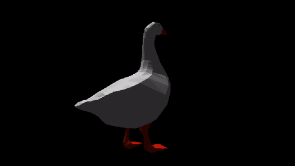

# er
A software renderer-er using concepts from the OpenGL graphics pipeline.

Plus a somewhat working .obj loader.

## Finished
- rasterization (edge function test)
- interpolation (using barycentric coordinates)
- depth testing (simple z buffer)
- projection (perspective)
- visible surface detection (face clipping + back face detection)
- texture sampling (wrap around + nearest pixels)
- some way to add shader globals 
    (1.0: shader classes with static variables and shader functions)
    (2.0: member variables in shader class)
- generalize    -vertex shader -pixel shader
    (with a new class derived from Shader overriding virtual functions)
- camera view
- default shaders (somewhat)
                

## In progress
- .obj loader + obj load shader (textures remaining)
- lights (point light tested + specular lighting seems to work incorrectly)

## TODO: 
- perspective correct interpolation
- binary space partitioning?
- some way to generalize points
- multithreading triangle rasterization using thread pools
- SIMD in rasterization
